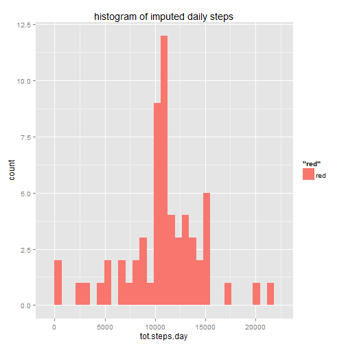
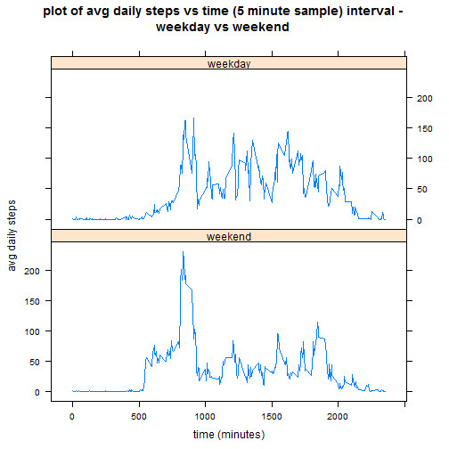

Background: Fitbit measured step data from an anonymous user over 5 minute intervals over a period of 2 months.

-Loading and preprocessing data

```r
path <- "E:/Coursera/reproresearch/assignment1/"
setwd(path)

file.name <- unzip("repdata_data_activity.zip", list=TRUE)$Name[1]
unzip("repdata_data_activity.zip",files=file.name,overwrite=TRUE)

file.raw <- read.csv("activity.csv", header=TRUE)


#create dataframe for data exploration and analysis
fit.df <- data.frame(file.raw)
```

What is mean total number of steps taken per day?

For this part of the assignment, you can ignore the missing values in the dataset.

    Make a histogram of the total number of steps taken each day

    Calculate and report the mean and median total number of steps taken per day


```r
library(ggplot2)
fit.rmvna <- na.omit(fit.df)
fit.rmvna$date <- as.Date(fit.rmvna$date)
attach(fit.rmvna)
```

```
## The following objects are masked from impute.df (pos = 4):
## 
##     date, interval, steps
## 
## The following objects are masked from fit.df:
## 
##     date, interval, steps
## 
## The following objects are masked from impute.df (pos = 6):
## 
##     date, interval, steps
## 
## The following objects are masked from impute.df (pos = 7):
## 
##     date, interval, steps
## 
## The following objects are masked from fit.rmvna (pos = 9):
## 
##     date, interval, steps
```

```r
# total number of steps taken each day
tot.steps.day <- tapply(steps,date,sum)

mean(tot.steps.day)
```

```
## [1] 10766.19
```

```r
median(tot.steps.day)
```

```
## [1] 10765
```

```r
qplot(tot.steps.day, binwidth=(max(tot.steps.day)-min(tot.steps.day))/30, fill='red')
```

 

```r
summary(fit.df)
```

```
##      steps                date          interval     
##  Min.   :  0.00   2012-10-01:  288   Min.   :   0.0  
##  1st Qu.:  0.00   2012-10-02:  288   1st Qu.: 588.8  
##  Median :  0.00   2012-10-03:  288   Median :1177.5  
##  Mean   : 37.38   2012-10-04:  288   Mean   :1177.5  
##  3rd Qu.: 12.00   2012-10-05:  288   3rd Qu.:1766.2  
##  Max.   :806.00   2012-10-06:  288   Max.   :2355.0  
##  NA's   :2304     (Other)   :15840
```

What is the average daily activity pattern?

    Make a time series plot (i.e. type = "l") of the 5-minute interval (x-axis) and the average number of steps taken, averaged across all days (y-axis)

    Which 5-minute interval, on average across all the days in the dataset, contains the maximum number of steps?


```r
avg.steps <- tapply(steps,interval,mean)
 qplot(unique(interval),avg.steps,geom=c('line'),main='avg number of daily steps vs. time of day',ylab='avg daily steps',xlab='time (minutes)')
```

 

```r
print(paste('5 minute interval that contains the max average steps ==',
round(max(avg.steps),2),'  is interval = ', as.numeric(interval[which(avg.steps==max(avg.steps))]), "note that is about 835/60=14 hours or ~ 2PM"))
```

```
## [1] "5 minute interval that contains the max average steps == 206.17   is interval =  835 note that is about 835/60=14 hours or ~ 2PM"
```
Impute missing values

1) display incomplete cases

```r
detach(fit.rmvna); attach(fit.df)
```

```
## The following objects are masked from impute.df (pos = 4):
## 
##     date, interval, steps
## 
## The following objects are masked from fit.df (pos = 5):
## 
##     date, interval, steps
## 
## The following objects are masked from impute.df (pos = 6):
## 
##     date, interval, steps
## 
## The following objects are masked from impute.df (pos = 7):
## 
##     date, interval, steps
## 
## The following objects are masked from fit.rmvna:
## 
##     date, interval, steps
```

```r
incomplete.cases <- dim(fit.df[is.na(fit.df),])[1]
print(paste('incomplete cases (NA) =',incomplete.cases))
```

```
## [1] "incomplete cases (NA) = 2304"
```
2) 1st inspect, then impute NA values by interval means and re-run mean, median, and histogram plot.

```r
summary(fit.df)
```

```
##      steps                date          interval     
##  Min.   :  0.00   2012-10-01:  288   Min.   :   0.0  
##  1st Qu.:  0.00   2012-10-02:  288   1st Qu.: 588.8  
##  Median :  0.00   2012-10-03:  288   Median :1177.5  
##  Mean   : 37.38   2012-10-04:  288   Mean   :1177.5  
##  3rd Qu.: 12.00   2012-10-05:  288   3rd Qu.:1766.2  
##  Max.   :806.00   2012-10-06:  288   Max.   :2355.0  
##  NA's   :2304     (Other)   :15840
```

```r
steps.interval <- do.call(rbind,split(steps,date))
impute.dtetime <- colMeans(na.omit(steps.interval))
impute.col <- rep(impute.dtetime, dim(fit.df)[1]/length(impute.dtetime))
impute.df <- cbind(fit.df, impute.col) # tmp dataframe to align impute data
impute.df$steps[is.na(impute.df$steps)] <- impute.col[is.na(impute.df$steps)] # replace NAs with imputed time values
impute.df <- impute.df[,-4] # clean up by removing extra impute col

summary(impute.df) # note no more NA values with imputed set.
```

```
##      steps                date          interval     
##  Min.   :  0.00   2012-10-01:  288   Min.   :   0.0  
##  1st Qu.:  0.00   2012-10-02:  288   1st Qu.: 588.8  
##  Median :  0.00   2012-10-03:  288   Median :1177.5  
##  Mean   : 37.38   2012-10-04:  288   Mean   :1177.5  
##  3rd Qu.: 27.00   2012-10-05:  288   3rd Qu.:1766.2  
##  Max.   :806.00   2012-10-06:  288   Max.   :2355.0  
##                   (Other)   :15840
```

```r
attach(impute.df)
```

```
## The following objects are masked from fit.df (pos = 3):
## 
##     date, interval, steps
## 
## The following objects are masked from impute.df (pos = 5):
## 
##     date, interval, steps
## 
## The following objects are masked from fit.df (pos = 6):
## 
##     date, interval, steps
## 
## The following objects are masked from impute.df (pos = 7):
## 
##     date, interval, steps
## 
## The following objects are masked from impute.df (pos = 8):
## 
##     date, interval, steps
## 
## The following objects are masked from fit.rmvna:
## 
##     date, interval, steps
```

```r
tot.steps.day <- tapply(steps,date,sum)

mean(tot.steps.day)
```

```
## [1] 10766.19
```

```r
median(tot.steps.day)
```

```
## [1] 10766.19
```

```r
qplot(tot.steps.day, binwidth=(max(tot.steps.day)-min(tot.steps.day))/30, fill='red', main= 'histogram of imputed daily steps')
```

 

4) Make a histogram of the total number of steps taken each day and Calculate and report the mean and median total number of steps taken per day. Do these values differ from the estimates from the first part of the assignment? What is the impact of imputing missing data on the estimates of the total daily number of steps

The averages of the imputed values did not change. That was expected since we are using averages of data to impute back in. Median and mean are closer in imputed cases.


5) Are there differences in activity patterns between weekdays and weekends?

For this part the weekdays() function may be of some help here. Use the dataset with the filled-in missing values for this part.

    Create a new factor variable in the dataset with two levels - "weekday" and "weekend" indicating whether a given date is a weekday or weekend day.

    Make a panel plot containing a time series plot (i.e. type = "l") of the 5-minute interval (x-axis) and the average number of steps taken, averaged across all weekday days or weekend days (y-axis). See the README file in the GitHub repository to see an example of what this plot should look like using simulated data.
    

```r
library(lattice)
fit.dt <- transform(impute.df, date = as.Date(date,origin="1970-01-01"))
weekend <- weekdays(fit.dt$date) == "Saturday" | weekdays(fit.dt$date) == "Sunday"
weekend <- as.factor(weekend)
levels(weekend) <- c('weekend','weekday')
fit.wk <- data.frame(fit.dt,weekend)

#aggregate and panel plot of weekday vs weekend data
avg.steps <-aggregate(steps ~ interval + weekend, data=fit.wk,mean)
xyplot(steps ~ interval | weekend, type='l', layout = c(1,2), data = avg.steps, main = "plot of avg daily steps vs time (5 minute sample) interval - 
weekday vs weekend ", ylab = "avg daily steps", xlab = "time (minutes)")
```

 
    
## Conclusion
The data are similar, but the weekend shows a silghtly larger surge around noon and less more walking during the rest of the day on weekdays. Walkers likely relax a bit more on weekends.


